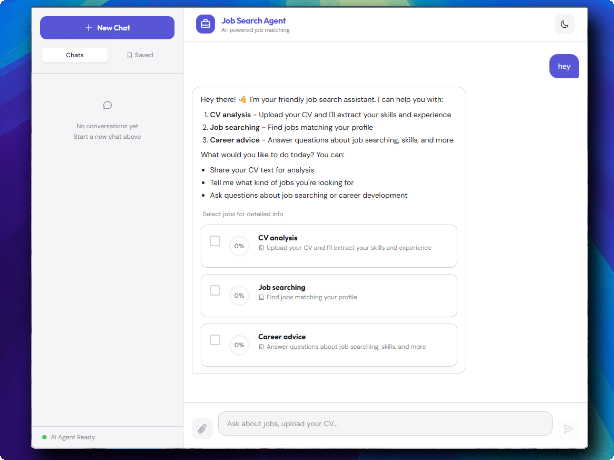

# Job Search Agent


Upload your CV, and the agent reads your skills, searches the web for matching jobs, and ranks them by how well they fit your profile -- all through a simple chat interface. Built on [LangChain DeepAgent](https://docs.langchain.com/oss/python/deepagents/overview), a framework that lets an AI orchestrator delegate tasks to specialized sub-agents, each with their own tools.



## Key Features

- **CV upload** -- structured profile extraction (skills, experience, job titles)
- **Two-phase job search** -- quick search (Tavily/Brave) returns 15 scored jobs, then detail scrape (Firecrawl) on selected jobs for salary, requirements, and benefits
- **Job scoring 0-100** with match reasons explaining why each job fits your profile
- **Human-in-the-loop** -- approve or reject before external API calls are made
- **Real-time SSE streaming** with actual agent events (not polling)
- **Chat interface** with session persistence across page reloads
- **Guided onboarding UX** -- upload a CV or describe your skills to get started
- **Apple-calm UI design** -- Indigo accent, Outfit + DM Sans typography, dark/light mode

## Tech Stack

| Layer | Technologies |
|-------|-------------|
| **Backend** | FastAPI, SQLAlchemy, Pydantic, slowapi |
| **Frontend** | React 19, Vite 7, Tailwind CSS 4, react-markdown |
| **Infrastructure** | PostgreSQL 16, Redis 7, Docker, nginx |
| **AI / Agents** | DeepAgents, LangChain, LangGraph, DeepSeek-V3 |
| **Search** | Tavily, Brave Search, Firecrawl |
| **PDF** | PyPDF |

## Quickstart

### Option A: Docker (recommended)

```bash
# 1. Clone and configure
git clone <repo-url>
cd job-search-agent
cp .env.example .env  # Edit with your API keys

# 2. Build and start everything
docker compose up --build -d
```

Open **http://localhost** -- nginx serves the frontend and proxies API calls to the backend.

To restart later (no rebuild needed):
```bash
docker compose up -d
```

To rebuild after code changes:
```bash
docker compose up --build -d
```

### Option B: Local development

```bash
# Prerequisites: Python 3.11+, Node.js 22+, Docker (for Postgres/Redis)

# 1. Clone and install
git clone <repo-url>
cd job-search-agent
uv sync

# 2. Set up environment
cp .env.example .env  # Edit with your API keys

# 3. Start Postgres + Redis
docker compose up db redis -d

# 4. Start backend
uv run uvicorn backend.api.app:app --reload --host 127.0.0.1 --port 8020

# 5. Start frontend (new terminal)
cd frontend && npm install && npm run dev
```

- Backend runs at **http://127.0.0.1:8020**
- Frontend runs at **http://localhost:5173** (proxies API to backend)

## CLI Usage

```bash
uv run python main.py "path/to/cv.pdf"
```

The agent will:
1. Parse your CV and extract a structured profile (skills, experience, titles)
2. Show the profile summary and ask for confirmation
3. Request approval before calling external search APIs (HITL)
4. Search for matching jobs and display ranked results with match scores

## Architecture

### System Overview


```
                     ┌─────────────────────┐
  Port 80 ─────────→│  nginx (frontend)    │
                     │  - React SPA         │
                     │  - /api/* proxy      │
                     │  - /chat/* SSE proxy │
                     └────────┬────────────┘
                              │ proxy_pass
                     ┌────────▼────────────┐
  Port 8020 (int) →  │  uvicorn (backend)   │
                     │  - FastAPI REST+SSE  │
                     │  - Agent orchestrator│
                     └───┬────────────┬────┘
                         │            │
                ┌────────▼──┐  ┌─────▼─────┐
  Port 5432 →   │ PostgreSQL │  │   Redis   │ ← Port 6379
                │  (data)    │  │  (rate)   │
                └────────────┘  └───────────┘
                                       ↑
                              ┌────────┴────────┐
                              │ Tavily │ Brave   │
                              │ Firecrawl        │
                              └─────────────────┘
```

### Agent Hierarchy

```
Orchestrator (intent routing)
├── cv-parser (PDF → JSON profile)
├── quick-searcher (Tavily + Brave → 15 scored jobs)
└── detail-scraper (Firecrawl → salary, requirements, benefits)
```

### Intent Detection

The orchestrator classifies every user message into one of four intents:

| Intent | Action |
|--------|--------|
| `CV_UPLOAD` | Delegate to **CV Parser** sub-agent |
| `SEARCH_JOBS` | Delegate to **Quick Searcher** sub-agent |
| `REFINE` | Re-run job search with updated criteria |
| `CHAT` | Respond directly (no sub-agent needed) |

### Two-Phase Search Flow

**Phase 1 -- Quick Search:** The quick-searcher queries Tavily and Brave, returning up to 15 jobs with scores and match reasons. Results are displayed as selectable job cards with checkboxes.

**Phase 2 -- Detail Scrape:** The user selects specific jobs of interest. The detail-scraper uses Firecrawl to deep-scrape those job posting URLs, extracting salary ranges, detailed requirements, and benefits.

## API Endpoints

### Chat Endpoints

| Endpoint | Method | Description |
|----------|--------|-------------|
| `/chat/stream` | POST | SSE streaming chat response |
| `/chat/confirm` | POST | Approve/reject HITL interrupt (SSE) |
| `/chat/get-details` | POST | Detail scrape selected jobs (SSE) |
| `/chat/upload` | POST | Upload CV in chat context |
| `/chat/sessions` | GET | List all chat sessions |
| `/chat/{session_id}` | GET | Get chat history |
| `/chat/{session_id}` | DELETE | Delete session and messages |

### Other Endpoints

| Endpoint | Method | Description |
|----------|--------|-------------|
| `/cv/upload` | POST | Upload PDF, extract profile |
| `/profile` | GET | Get user profile (`X-User-ID` header) |
| `/preferences` | GET/PUT | Get or update preferences |
| `/search` | POST | Background job search |
| `/search/results` | GET | Poll results |
| `/health` | GET | Health check |

### SSE Event Types

| Event | Description |
|-------|-------------|
| `status` | Progress updates during agent processing |
| `agent_event` | Tool calls and sub-agent activity |
| `confirmation` | HITL approval request |
| `done` | Final response with results |
| `error` | Error details |

## Frontend

### Component Tree

```
Chat.jsx (main container, SSE streaming, session management)
├── Sidebar.jsx        — session history, new chat, delete
├── ChatMessage.jsx    — renders text (markdown), job cards, profile, onboarding
│   └── JobCard.jsx    — score ring (SVG), match reason, bookmark, apply CTA
└── ChatInput.jsx      — message input, drag-and-drop PDF upload
```

### Design

"Apple Calm" -- flat indigo accent (`#5856D6`), Outfit + DM Sans typography, dark/light mode. Responsive layout with collapsible sidebar and backdrop overlay on mobile.

## Database Schema

```
User ──┬── Profile (1:1)
       ├── Preferences (1:1)
       ├── SearchSession (1:N) → JobResult (1:N)
       └── ChatSession (1:N) → ChatMessage (1:N)
```

LangGraph checkpoint tables are auto-created by `PostgresSaver`.

## Environment Variables

| Variable | Required | Description |
|----------|----------|-------------|
| `DEEPSEEK_API_KEY` | Yes | LLM provider |
| `TAVILY_API_KEY` | Yes | Primary web search |
| `BRAVE_API_KEY` | No | Backup web search |
| `FIRECRAWL_API_KEY` | No | Deep page scraping |
| `DATABASE_URL` | No | PostgreSQL connection string |
| `REDIS_URL` | No | Rate limiting backend |
| `CORS_ORIGINS` | No | Allowed frontend origins |
| `LANGSMITH_API_KEY` | No | LangSmith tracing |
| `LANGSMITH_TRACING` | No | Enable tracing (`true`/`false`) |

## Project Structure

```
job-search-agent/
├── backend/
│   ├── agents/           # AI agent definitions
│   │   ├── orchestrator.py
│   │   ├── cv_parser.py
│   │   ├── quick_searcher.py
│   │   ├── detail_scraper.py
│   │   ├── job_searcher.py
│   │   ├── checkpointer.py
│   │   └── AGENTS.md
│   ├── api/
│   │   ├── app.py        # FastAPI application
│   │   ├── routes/       # API endpoints
│   │   └── schemas.py    # Pydantic models
│   ├── db/               # Database models + session
│   ├── utils/            # Parser, helpers
│   └── config.py
├── frontend/
│   ├── src/
│   │   ├── components/   # React components
│   │   ├── api.js        # API client
│   │   └── App.jsx
│   ├── Dockerfile        # Multi-stage: node build → nginx serve
│   └── nginx.conf        # Reverse proxy + SPA fallback
├── scripts/              # CLI test scripts
├── docs/                 # Tech spec, progress tracking
├── Dockerfile            # Multi-stage: uv build → python slim
├── docker-compose.yml    # All 4 services: db, redis, backend, frontend
├── pyproject.toml
├── main.py               # CLI entry point
└── .env.example
```

## Known Limitations

- **Token usage** -- elevated (~30-50% overhead) due to sub-agent context passing, mitigated by trimming and compact outputs
- **No authentication** -- user identified by `X-User-ID` header from CV upload

## Contributing

Contributions welcome! Please open an issue first to discuss proposed changes.

## License

MIT
